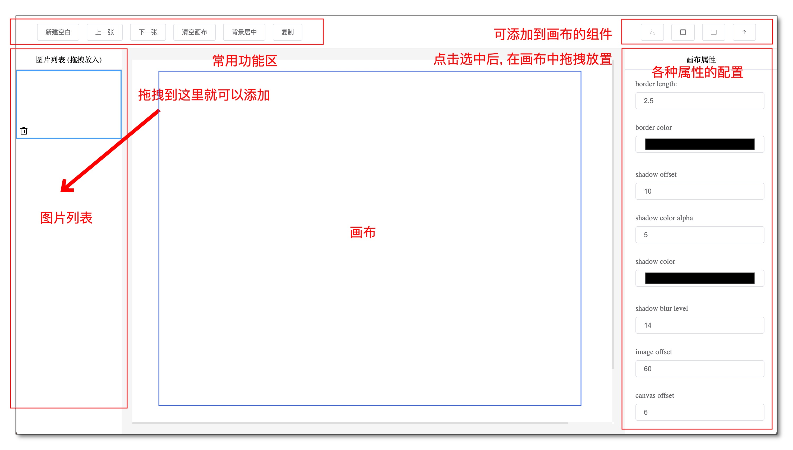

## Image-Border-Optimizer v2.2.3
## 轻量化的图片编辑器
## 在线 DEMO
- [GenOptimizer 在线演示地址](https://hellojuantu.github.io/image_border_optimizer/)

## 项目特点
- 纯原生 JS 开发, 无三方框架
- 基于自研 Optimizer 框架为基础
- 支持图片拖拽添加
- 支持画笔、文字、图形 添加
- 支持所有属性动态配置
- 支持多图操作, 一键复制, 处处可用

## Optimizer 框架特点
- 事件、画图、交互 全局管理
- 支持注册自定义组件, 可自定义配置管理
- 基于面向对象, 高度抽象代码
- 简单易用, 能快速开发出各种效果

## 更新日志

### GenOptimizer v2.2.3
- 修复了画板缩放后画笔轨迹不一致问题 ok
- 修复了画板缩放后文字输入定位问题 ok

### GenOptimizer v2.2.2
- 新增了创建空白页面, 可以直接在空白页面上绘制 ok
- 新增左边图片快照列表, 可以切换图片 ok
- 新增了图片的删除功能, 优化删除逻辑 ok
- 新增了图片的复制功能, 复制可以直接粘贴使用 ok
- 优化了图形放置的点按逻辑 ok
- 新增了画板缩放功能 ok

### GenOptimizer v2.0
- 做了大量的优化, 优化了代码结构, 优化了代码逻辑, 优化了代码的可读性 ok
- 优化了页面的布局, 优化了页面的交互 ok

### GenOptimizer v1.0
- 拖拽上传图片 ok
- 优化代码架构 ok
- 添加可输入字体 ok
- 添加常用图形 (矩形, 箭头) ok
- 添加键盘事件 ok
- 给图形添加拖拽点, 全局 canvas cursor 需要加上 ok
- 添加图形的删除 ok
- 箭头图形的点击 ok
- 添加图形的拖拽 ok
- 拖拽点改为圆圈 ok
- 添加拖拽点的拖拽 箭头 ok, 矩形 ok
- 图形激活后需要修改控制栏的参数 ok
- 修复图片上传后 场景 刷新配置问题 ok
- 优化切换图片保存修改内容 ok